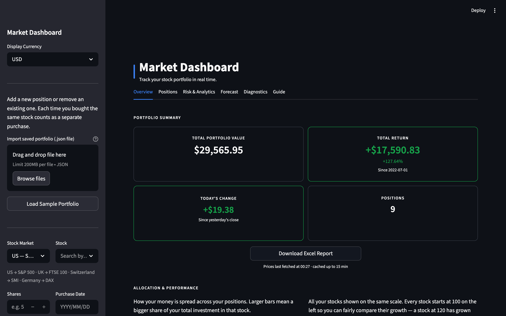
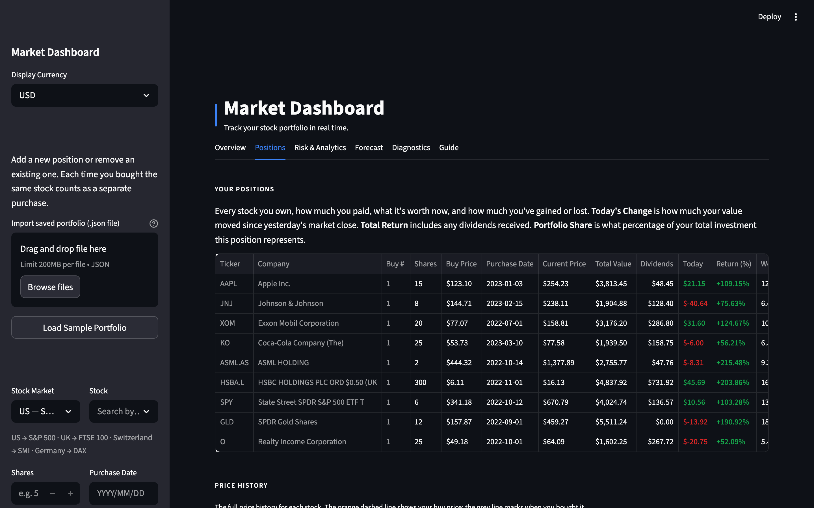
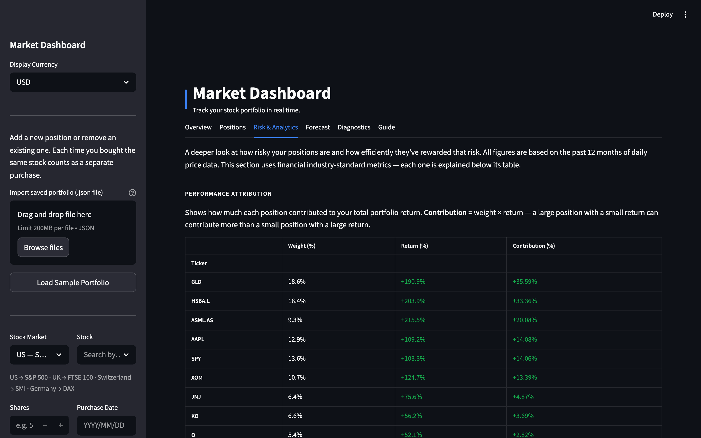
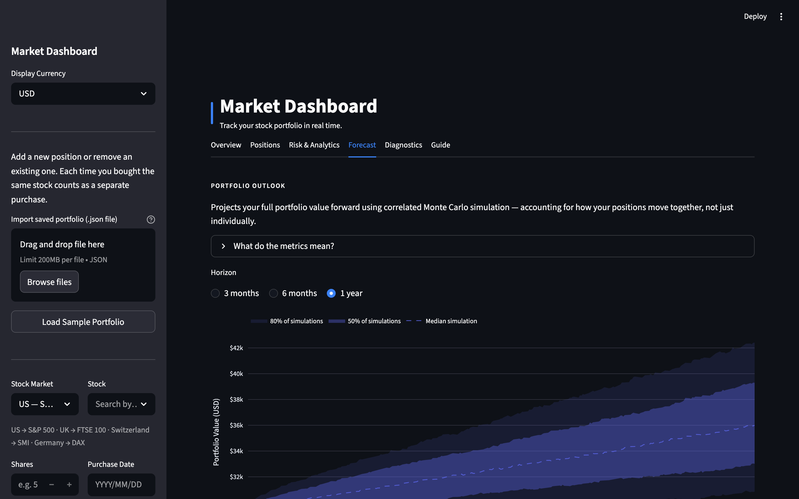

# Market Dashboard

A real-time stock portfolio tracker with Monte Carlo simulations, multi-currency support, and risk analytics. Built for European investors. Self-hostable.

[](https://fxportfolio.app)
[](https://www.gnu.org/licenses/agpl-3.0)



## Features

Seven tabs covering the full portfolio workflow:

### Overview
KPI cards (total value, daily P&L, total return, position count), allocation bar chart, and rebased performance chart with configurable time range and FX-adjusted toggle.


### Positions
Multi-lot positions table with current price, total value, dividends, daily change, return %, analyst target prices, and portfolio weight. Per-ticker price history chart with buy-price overlay and purchase date markers.



### Risk & Analytics
Per-ticker volatility, max drawdown, Sharpe ratio, and beta vs S&P 500. Pairwise correlation heatmap. P/E ratio, dividend yield, 52-week range. Sector breakdown and buy-only rebalancing calculator.



### Income
Dividend income tracking with monthly breakdown by ticker, converted to your base currency at historical FX rates.

### Forecast
Monte Carlo simulation with correlated multi-ticker paths. Portfolio and per-ticker outlook with confidence bands, VaR/CVaR, and probability of breakeven. Backtesting against actual prices.



### Diagnostics
Model diagnostics testing normality (Jarque-Bera) and independence (Ljung-Box) of daily returns. QQ plots for visual inspection.

### Guide
In-app documentation explaining each tab and how to use the dashboard.

### Key Features

- **Multi-currency** — USD, EUR, GBP, CHF, SEK with automatic FX conversion (including GBX handling for London-listed stocks)
- **Monte Carlo simulation** — correlated portfolio projections with backtesting
- **Dividend income tracking** — per-lot dividends from purchase date with historical FX rates
- **Contribution tracking** — cumulative cost basis vs portfolio market value over time
- **Encrypted storage** — portfolio data encrypted at rest with Fernet (PBKDF2-derived key)
- **Global stock coverage** — S&P 500, FTSE 100, DAX, CAC 40, SMI, AEX, IBEX 35, OMX 30, ETFs, crypto, commodities, REITs, bonds
- **Excel report export** — formatted multi-sheet `.xlsx` with embedded charts, formulas, and net worth template
- **Import / export** — save and load portfolios as JSON

## Quick Start

### From source

```bash
git clone https://github.com/joakim-hersche/market-dashboard.git
cd market-dashboard
pip install -r requirements.txt
python main.py
```

Open http://localhost:8080

### Docker

```bash
docker build -t market-dashboard .
docker run -p 8080:8080 market-dashboard
```

## Self-Hosting

See [DEPLOY.md](DEPLOY.md) for deployment guides covering Fly.io, Oracle Cloud Free Tier, and Cloudflare setup.

## Tech Stack

- [Python 3.12](https://python.org)
- [NiceGUI](https://nicegui.io) — reactive web UI
- [yfinance](https://github.com/ranaroussi/yfinance) — real-time stock, FX, and dividend data
- [pandas](https://pandas.pydata.org) / [NumPy](https://numpy.org) — data processing
- [Plotly](https://plotly.com/python/) — interactive charts
- [scipy](https://scipy.org) / [statsmodels](https://statsmodels.org) — statistical tests
- [openpyxl](https://openpyxl.readthedocs.io) — Excel report generation

## Project Structure

```
market-dashboard/
├── main.py                    # NiceGUI application entry point
├── src/
│   ├── cache.py               # TTL-based caching for API responses
│   ├── charts.py              # Plotly chart builders
│   ├── data_fetch.py          # yfinance wrappers with caching
│   ├── excel_export.py        # Multi-sheet Excel generation
│   ├── fx.py                  # FX rate fetching and currency detection
│   ├── monte_carlo.py         # Simulation engine and backtest
│   ├── portfolio.py           # Portfolio P&L calculations
│   ├── stocks.py              # Stock list fetching
│   ├── theme.py               # Design tokens and global CSS
│   └── ui/
│       ├── forecast.py        # Forecast and Diagnostics tabs
│       ├── guide.py           # Guide tab
│       ├── overview.py        # Overview tab and Excel export
│       ├── positions.py       # Positions tab
│       ├── risk.py            # Risk & Analytics tab
│       ├── shared.py          # Shared UI utilities
│       └── sidebar.py         # Sidebar and persistence
├── data/
│   └── sample_portfolio.json
├── static/
│   └── manifest.json          # PWA manifest
├── Dockerfile
├── fly.toml
├── requirements.txt
└── README.md
```

## Contributing

See [TODO.md](TODO.md) for the current roadmap. Issues and PRs welcome.

## License

[AGPL v3](https://www.gnu.org/licenses/agpl-3.0) — see [LICENSE](LICENSE).

## Disclaimer

The Monte Carlo simulation and all probability figures in this dashboard are statistical outputs based on historical return distributions. They do not constitute financial advice, and they do not account for future events, news, earnings, or macroeconomic changes not reflected in past prices. Positions flagged as fat-tailed (high excess kurtosis) violate the model's normality assumption — confidence bands for those assets will understate real tail risk. Use this tool as one analytical input among many.

## Technical Notes

- **GBX/GBP handling** — London Stock Exchange tickers (`.L`) are quoted in pence by yfinance. All `.L` prices are divided by 100 before P&L or FX calculations.
- **Dividend adjustment** — dividends are fetched per lot from the purchase date. Historical FX rates are applied at each ex-dividend date for accurate cross-currency income conversion.
- **Tiered caching** — 15-minute TTL for current quotes, 24-hour TTL for price history, stock lists, and fundamentals.
- **Multi-lot support** — each ticker can hold multiple lots with independent purchase dates and prices.
- **Monte Carlo** — log-normally distributed daily returns calibrated from up to 5 years of history. Correlated multi-ticker paths via Cholesky decomposition. Backtested for reliability.
