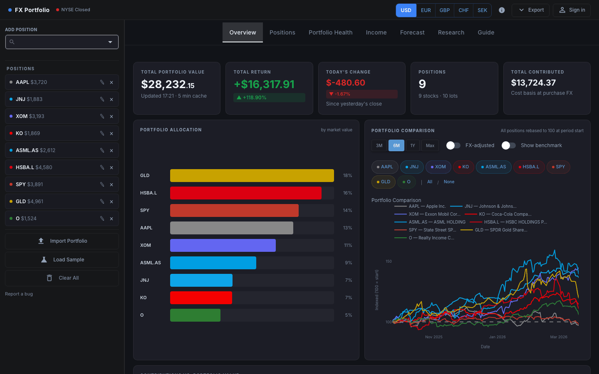
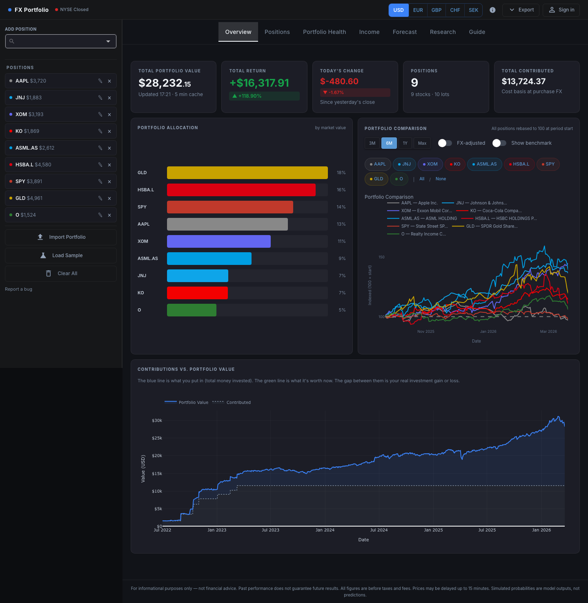
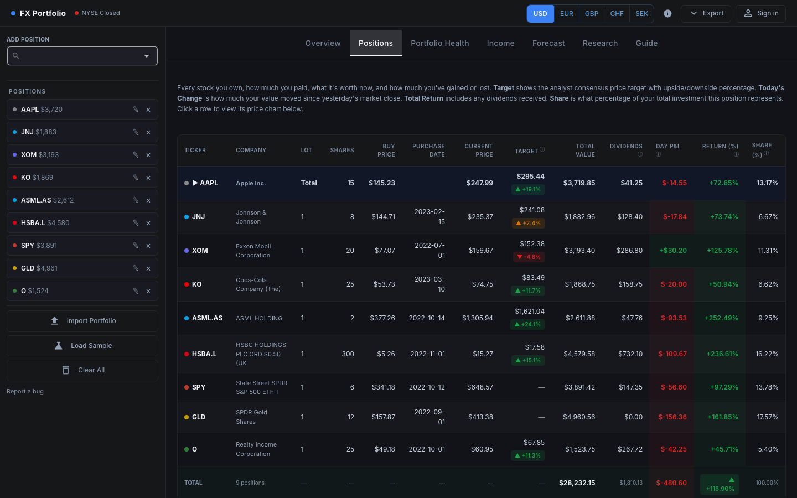
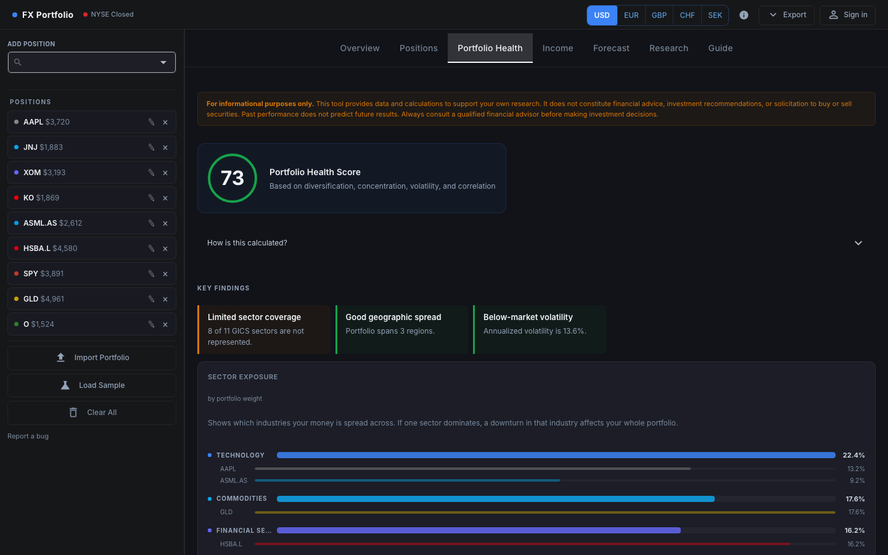
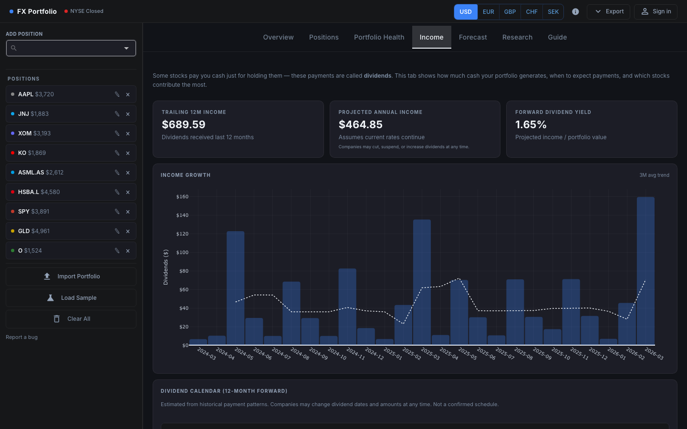
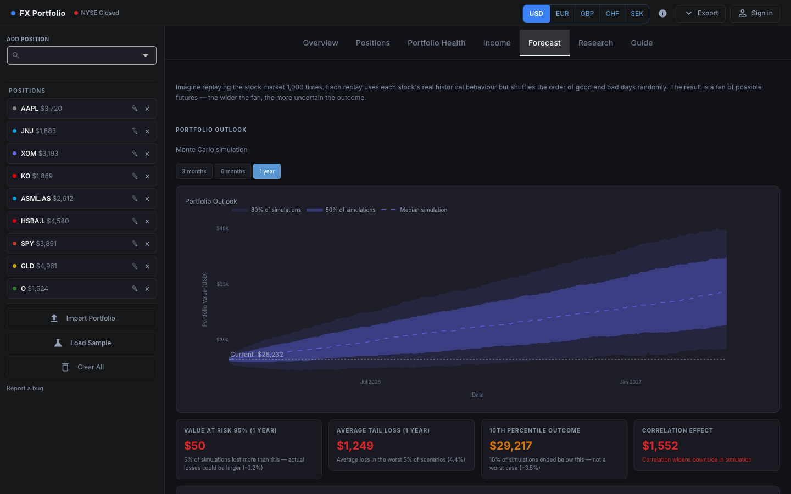
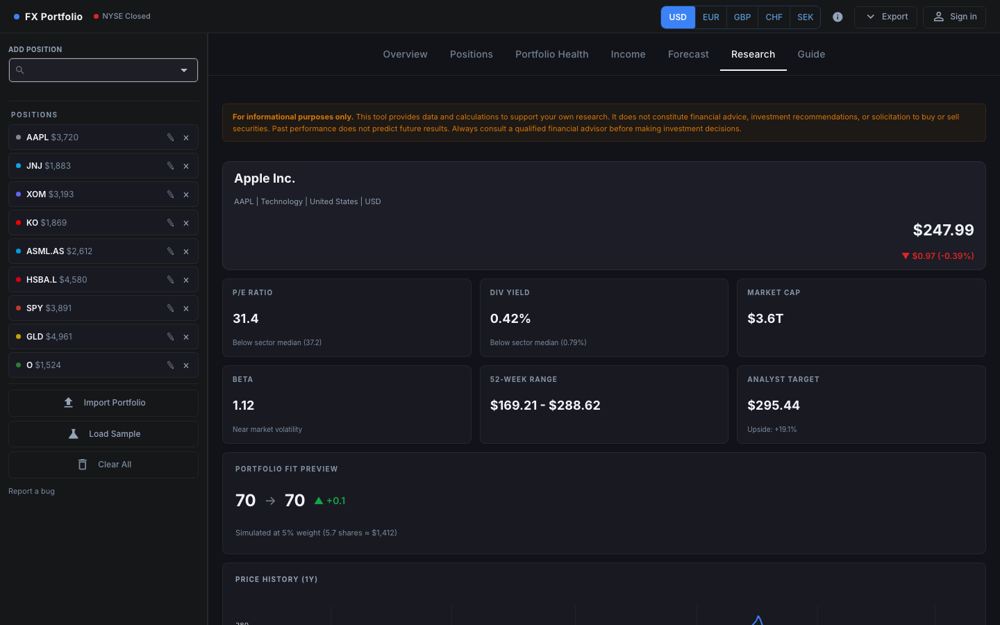

# FX Portfolio

Real-time stock portfolio tracker with Monte Carlo simulations, multi-currency support, and risk analytics. Built for European investors.

[](https://fxportfolio.app)
[](https://www.gnu.org/licenses/agpl-3.0)
[](https://python.org)



## Features

- **Multi-currency** — USD, EUR, GBP, CHF, SEK with automatic FX conversion (including GBX handling for London-listed stocks)
- **Monte Carlo simulation** — correlated multi-ticker paths with backtesting
- **Dividend income tracking** — per-lot dividends from purchase date with historical FX rates
- **Portfolio health scoring** — per-position risk flags, recommendations, and alerts
- **Stock research** — peer comparison, analyst price targets, fundamentals
- **Risk analytics** — volatility, Sharpe ratio, beta, max drawdown, correlation heatmap
- **Rebalancing calculator** — buy-only rebalancing to target weights
- **Excel report export** — formatted multi-sheet `.xlsx` with embedded charts and formulas
- **Global coverage** — S&P 500, FTSE 100, DAX, CAC 40, SMI, AEX, IBEX 35, OMX 30, ETFs, crypto, commodities, REITs, bonds
- **Contribution tracking** — cumulative cost basis vs portfolio market value over time
- **Import / export** — save and load portfolios as JSON
- **Encrypted storage** — portfolio data encrypted at rest, user authentication, mobile-responsive

## Tabs

### Overview

KPI cards (total value, daily P&L, total return, position count), allocation bar chart, and rebased performance chart with configurable time range and FX-adjusted toggle.



### Positions

Multi-lot positions table with current price, total value, dividends, daily change, return %, analyst target prices, and portfolio weight. Per-ticker price history chart with buy-price overlay and purchase date markers.



### Portfolio Health

Portfolio health score with per-position risk flags and recommendations. Per-ticker volatility, max drawdown, Sharpe ratio, beta, P/E ratio, dividend yield, 52-week range. Sector breakdown and buy-only rebalancing calculator.



### Income

Dividend income tracking with monthly breakdown by ticker, projected annual income, and portfolio yield. Converted to your base currency at historical FX rates.



### Forecast

Monte Carlo simulation with correlated multi-ticker paths. Portfolio and per-ticker outlook with confidence bands, VaR/CVaR, and probability of breakeven. Backtesting against actual prices. Includes model diagnostics (Jarque-Bera, Ljung-Box, QQ plots).



### Research

Stock screener with peer comparison, analyst price targets, and key fundamentals.



### Guide

In-app documentation explaining each tab and how to use the dashboard.

## Try It

**[fxportfolio.app](https://fxportfolio.app)** — sign up free and add your positions.

## Quick Start

Requires Python 3.12+.

### From source

```bash
git clone https://github.com/joakim-hersche/market-dashboard.git
cd market-dashboard
pip install -r requirements.txt
python main.py
```

Open http://localhost:8080

### Docker

```bash
docker build -t fx-portfolio .
docker run -p 8080:8080 fx-portfolio
```

Self-hosted mode runs without auth/billing (local file storage).

## Tech Stack

- [Python 3.12](https://python.org)
- [NiceGUI](https://nicegui.io) — reactive web UI
- [yfinance](https://github.com/ranaroussi/yfinance) — real-time stock, FX, and dividend data
- [pandas](https://pandas.pydata.org) / [NumPy](https://numpy.org) — data processing
- [Plotly](https://plotly.com/python/) — interactive charts
- [scipy](https://scipy.org) / [statsmodels](https://statsmodels.org) — statistical tests
- [openpyxl](https://openpyxl.readthedocs.io) — Excel report generation
- [PostgreSQL](https://www.postgresql.org) ([psycopg](https://www.psycopg.org)) — production database
- [Stripe](https://stripe.com) — payment processing
- [bcrypt](https://github.com/pyca/bcrypt) — password hashing
- [resend](https://resend.com) — transactional email

## Project Structure

```
fx-portfolio/
├── main.py              # Application entry point
├── src/                 # Core business logic (data fetching, calculations, charts, auth, billing)
│   └── ui/              # All tab implementations
├── static/              # PWA manifest and static assets
├── data/                # Sample portfolio data
├── tests/               # Test suite
├── Dockerfile
├── fly.toml
└── requirements.txt
```

## Contributing

Issues and PRs welcome.

## License

[AGPL v3](https://www.gnu.org/licenses/agpl-3.0) — see [LICENSE](LICENSE).

## Disclaimer

The Monte Carlo simulation and all probability figures in this dashboard are statistical outputs based on historical return distributions. They do not constitute financial advice, and they do not account for future events, news, earnings, or macroeconomic changes not reflected in past prices. Positions flagged as fat-tailed (high excess kurtosis) violate the model's normality assumption — confidence bands for those assets will understate real tail risk. Use this tool as one analytical input among many.

## Technical Notes

- **GBX/GBP handling** — London Stock Exchange tickers (`.L`) are quoted in pence by yfinance. All `.L` prices are divided by 100 before P&L or FX calculations.
- **Dividend adjustment** — dividends are fetched per lot from the purchase date. Historical FX rates are applied at each ex-dividend date for accurate cross-currency income conversion.
- **Tiered caching** — 15-minute TTL for current quotes, 24-hour TTL for price history, stock lists, and fundamentals.
- **Multi-lot support** — each ticker can hold multiple lots with independent purchase dates and prices.
- **Monte Carlo** — log-normally distributed daily returns calibrated from up to 5 years of history. Correlated multi-ticker paths via Cholesky decomposition. Backtested for reliability.
