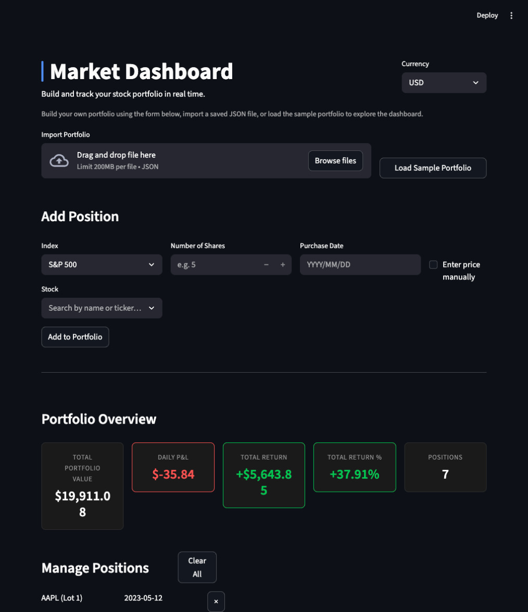
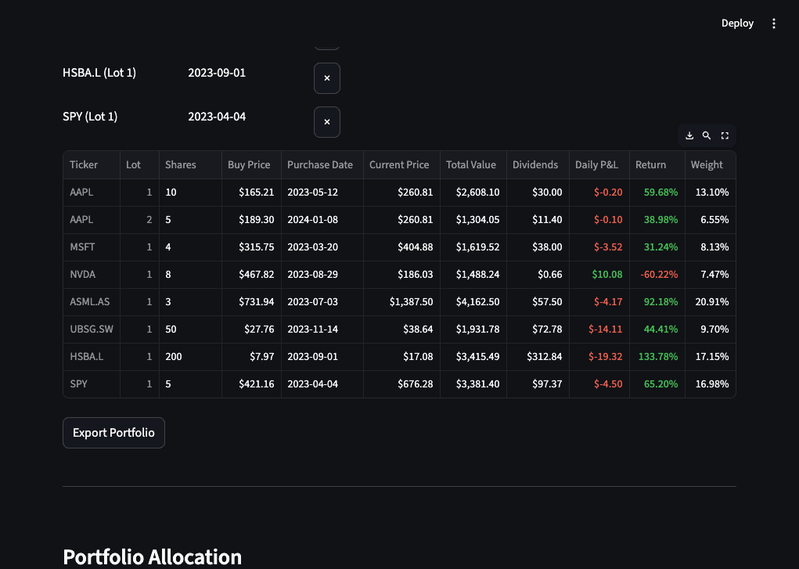
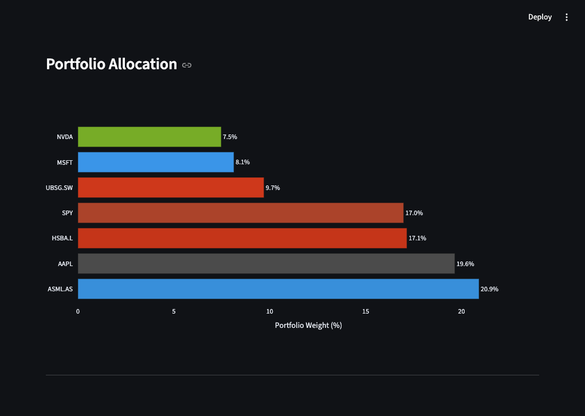
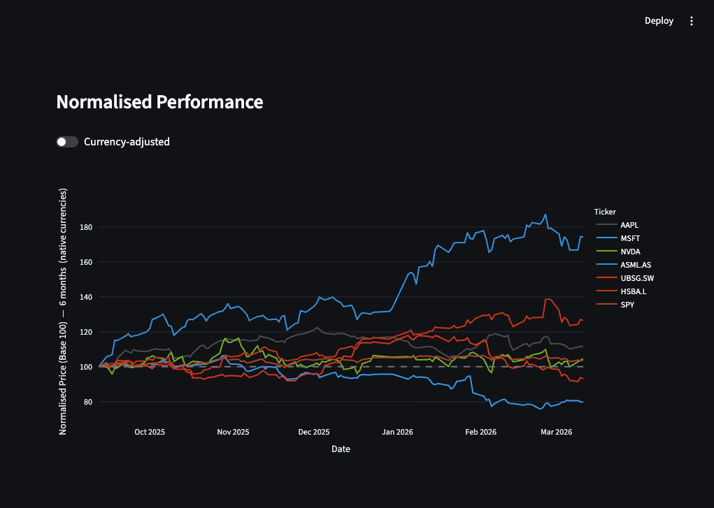
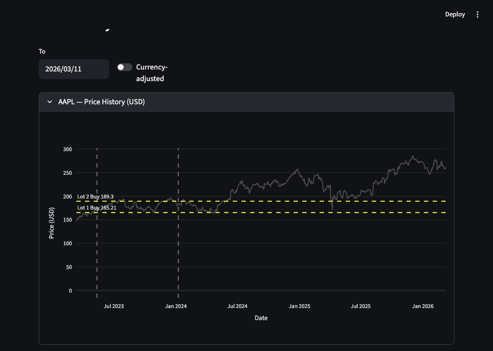

# Market Dashboard

A real-time stock portfolio tracker built with Streamlit. Add positions across major global exchanges, monitor performance in your home currency, and visualise portfolio allocation and price history.



[](https://market-dashboard-open-source-project.streamlit.app)
[](https://www.gnu.org/licenses/agpl-3.0)

## Features

- **Portfolio management** — add and remove positions across multiple lots per ticker
- **Multi-currency support** — live FX conversion across USD, EUR, GBP, and CHF
- **Performance metrics** — current value, daily P&L, return %, and portfolio weight per position; colour-coded green/red in the positions table
- **Dividend tracking** — dividends fetched from purchase date with historical FX conversion, factored into total return
- **Interactive charts** — portfolio allocation bar chart, normalised performance comparison with configurable time range (3M / 6M / 1Y / All time), and individual price history with buy price and purchase date overlays; click legend items to show/hide individual lines
- **Global stock coverage** — S&P 500, FTSE 100, DAX, CAC 40, SMI, AEX, IBEX 35, ETFs, crypto, commodities, REITs, bonds, and emerging markets; searchable via index-filtered dropdown
- **Risk analytics** — per-ticker volatility, max drawdown, Sharpe ratio, and beta vs S&P 500; pairwise correlation heatmap; P/E ratio, dividend yield, and 52-week range
- **Monte Carlo simulation** — forward-looking price projection for individual positions with 50%/80% confidence bands, buy price overlays, and probability of being above breakeven at a chosen horizon (3M / 6M / 1Y)
- **Monte Carlo backtest** — validates the model against the past year of actual portfolio data; reports per-ticker hit rates, excess kurtosis, and a reliability label so you know which positions the model fits well
- **Excel report export** — download a formatted multi-sheet `.xlsx` report with embedded charts, live formulas, and a pre-built template for manually adding other assets (real estate, private equity, etc.) to calculate total net worth
- **Import / export** — save and load your portfolio as JSON, with validated parsing on import
- **Performance** — all price data and stock lists are cached; price history charts lazy-load on demand

## Screenshots

### Positions Table
Colour-coded returns and P&L, with dividends, weight, and per-lot tracking across multiple exchanges.



### Portfolio Allocation
Horizontal bar chart sorted by weight, with brand colours for known tickers.



### Normalised Performance
Comparison chart with all positions rebased to 100. Configurable time range (3M / 6M / 1Y / All time). Toggle currency-adjusted mode. Click legend to show/hide individual stocks.



### Price History
Per-ticker price chart with buy price overlays (yellow) and purchase date markers for each lot. Configurable date range with presets (3M / 6M / 1Y / 2Y / Since purchase) or custom from/to dates.



## Setup

1. Clone the repository
```
git clone https://github.com/joakim-hersche/market-dashboard.git
cd market-dashboard
```

2. Install dependencies
```
pip install -r requirements.txt
```

3. Run the app
```
streamlit run app.py
```

## Project Structure

```
market-dashboard/
├── app.py                # Streamlit application
├── src/
│   ├── portfolio.py      # Portfolio construction and P&L calculations
│   ├── monte_carlo.py    # Monte Carlo simulation and backtest
│   ├── stocks.py         # Stock list fetching (Wikipedia scraper)
│   ├── fx.py             # FX rate fetching and currency detection
│   └── excel_export.py   # Multi-sheet Excel report generation
├── data/
│   └── sample_portfolio.json
├── Screenshots/
├── requirements.txt
└── README.md
```

## Tech Stack

- Python 3.12
- [Streamlit](https://streamlit.io) — web UI
- [yfinance](https://github.com/ranaroussi/yfinance) — real-time stock, FX, and dividend data
- [pandas](https://pandas.pydata.org) — data processing
- [Plotly](https://plotly.com/python/) — interactive charts
- [openpyxl](https://openpyxl.readthedocs.io) — Excel report generation

## Disclaimer

The Monte Carlo simulation and all probability figures in this dashboard are statistical outputs based on historical return distributions. They do not constitute financial advice, and they do not account for future events, news, earnings, or macroeconomic changes not reflected in past prices. Positions flagged as fat-tailed (high excess kurtosis) violate the model's normality assumption — confidence bands for those assets will understate real tail risk. Use this tool as one analytical input among many.

## Technical Notes

- **GBX/GBP handling** — London Stock Exchange tickers (`.L`) are quoted in pence by yfinance. All `.L` prices are divided by 100 before P&L or FX calculations to correct for this.
- **Dividend adjustment** — dividends are fetched per lot from the purchase date using `yfinance.Ticker.history()`. Historical FX rates are applied at each ex-dividend date so cross-currency income positions are converted accurately, not at today's rate.
- **Tiered caching** — two `@st.cache_data` TTLs: 15 minutes for current quotes (acceptable staleness for intraday use) and 24 hours for full price history and stock lists (expensive fetches that rarely change).
- **Multi-lot support** — each ticker can hold multiple lots with independent purchase dates and prices. The normalised chart groups by ticker using the earliest lot's start date.
- **Error handling** — all yfinance calls are wrapped in try/except with graceful `st.warning` fallbacks, so a single failed ticker doesn't crash the dashboard.
- **Monte Carlo** — simulations use log-normally distributed daily returns calibrated from up to 5 years of historical data. Correlated multi-ticker paths are generated via Cholesky decomposition of the historical covariance matrix. Per-ticker reliability is validated by backtesting the model against the past year of actual prices. Tickers with insufficient history (< 2 years) are excluded from the backtest automatically.
